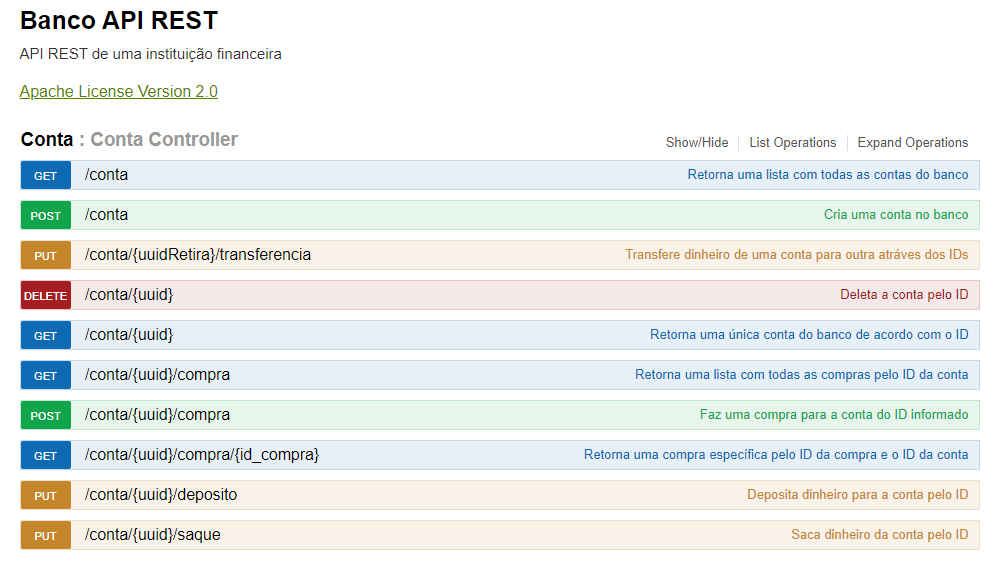
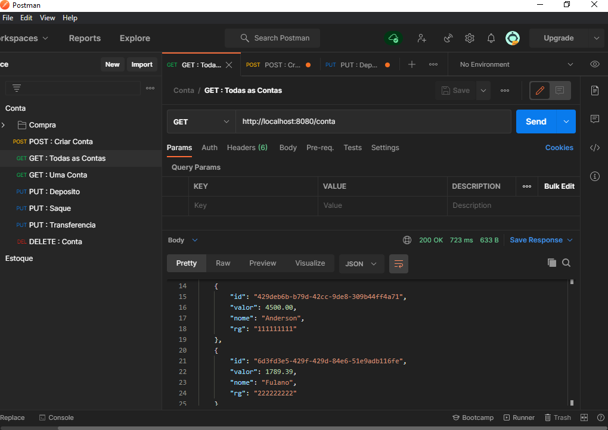
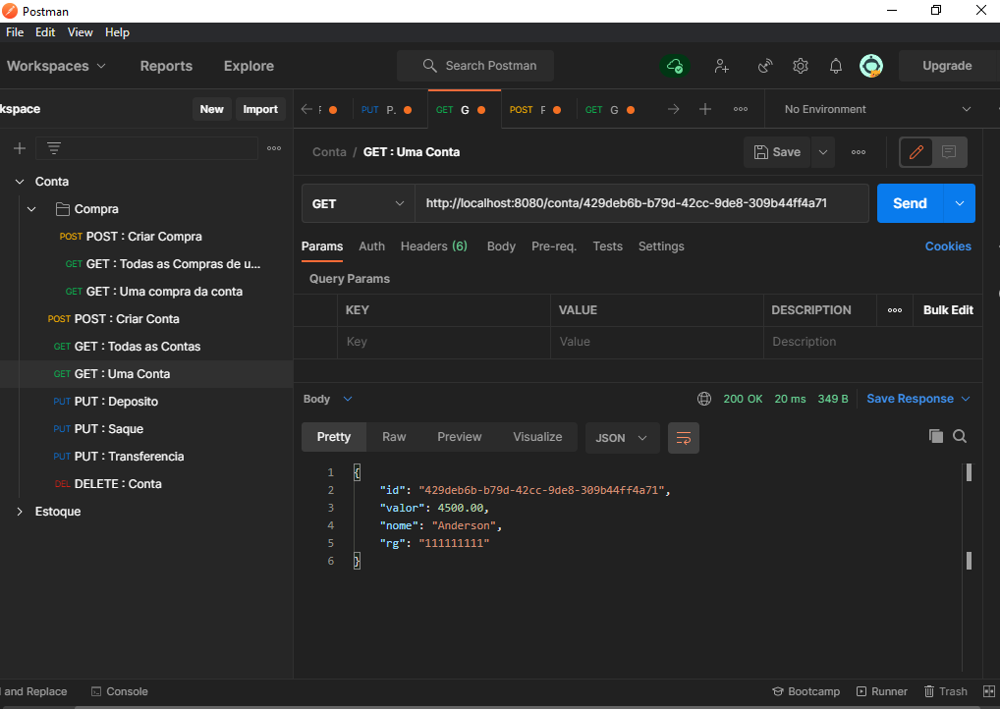
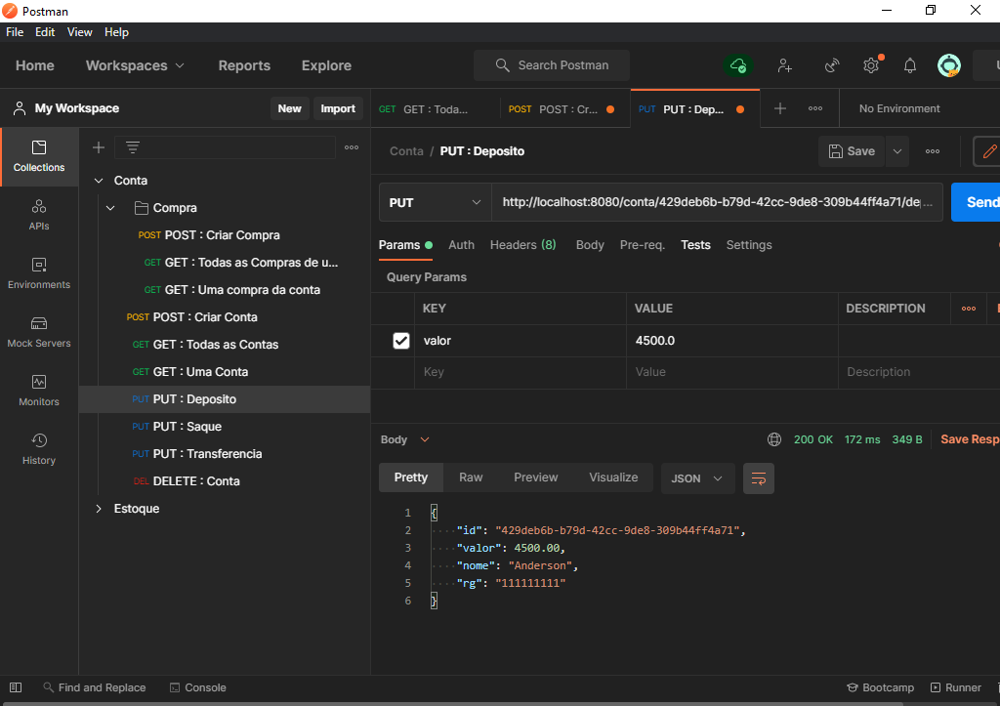

<h1 align="center">Banco API REST</h1>

Concluído :rocket: 

  <a href="#Sobre">Sobre</a> •
  <a href="#Funcionalidades">Funcionalidades</a> •
  <a href="#Executar">Como Executar</a> •
  <a href="#Tecnologias">Tecnologias</a> •
  <a href="#Autor">Autor</a> •
  <a href="#Licenca">Licença</a>

<h2 id="Sobre">:computer: Sobre o projeto</h2>

Esta é uma API de pagamento, eu chamo ela de banco, com ela é possível fazer operações básicas de um banco, como: depositar, sacar, trasferir, comprar e entre outras funcionalidades. 

Este projeto foi um desafio sugerido pelo <a href="https://www.linkedin.com/in/cesar-sales/">Cesar Sales</a> com o objetivo de eu aprender tecnologias, ferramentas e técnicas modernas voltadas ao desenvolvimento backend por meio da linguaguem Java, além disso ele me deu muitas dicas e orientações ao longo do desenvolvimento.

<h2 id="Funcionalidades">⚙️ Funcionalidades</h2>

  - [x] Cadastrar conta
  - [x] Consultar todas as contas
  - [x] Consultar conta específica
  - [x] Depositar dinheiro para a conta
  - [x] Sacar dinheiro da conta
  - [x] Transferir dinheiro entre contas
  - [x] Fazer compra com a conta
  - [x] Consultar todas as compras de um conta
  - [x] Consultar uma compra específica da conta 
  - [x] Deletar Conta

Endpoints para as funcionalidades: 

Consultar todas as contas: 

Consultar uma conta específica: 

Depositar dinheiro na conta: 

<h2 id="Executar">🚀 Como executar o projeto</h2>

Você pode ler a documentação e testar a api acessando o swagger do projeto no meu heroku clicando <a href="https://bancoapirest.herokuapp.com/swagger-ui.html#/Conta">aqui</a>

Caso você queira usar o Postman para testar o projeto basta usar a url: https://bancoapirest.herokuapp.com

<h2 id="Tecnologias">🛠 Tecnologias</h2>

Utilitários:

<h2 id="Autor">🦸 Autor</h2>

Anderson Correia é um entusiasta e apaixonados por programação, focado em resolver problemas através de códigos.

Esse projeto foi feito com muito ❤️ e carinho pelo Anderson 👋🏽 <a href="https://www.linkedin.com/in/anderson-correia/">Entre em contato!</a>

<h2 id="Licenca">📝 Licença</h2>

Este projeto esta sob a licença <a href="https://github.com/Anderson815/Banco_-_API_REST/blob/21319def9a25cc7482ffdfaba6b95a8bc2a1fe2d/LICENSE">MIT</a>.

