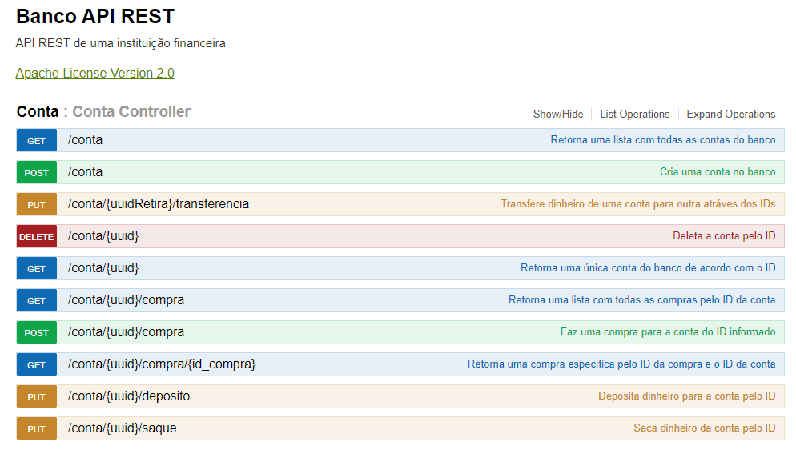

<h1>Banco - API REST</h1>

Este projeto foi um desafio sugerido pelo <a href="https://www.linkedin.com/in/cesar-sales/">Cesar Sales</a> com o objetivo de eu apreder tecnologias, ferramentas e técnicas modernas voltadas ao desenvolvimento backend por meio da linguaguem Java (lista das ferramentas na seção <a href="#habilidade">Habilidades Usadas</a>), além disso ele me deu muitas dicas e orientações ao longo do desenvolvimento.

Esta é uma API de pagamento, eu chamo ela de banco, com ela é possível fazer operações básicas de um banco, como: depositar, sacar, trasferir, comprar e entre outras funcionalidades (todas as funcionalidades estão na seção <a href="#endpoints">Endpoint</a>). 

  
Embora seja um projeto simples não deixa de ser completo, pois tem relacionamento entre entidades, há validação para as requisições, status code adequado para a resposta, um padrão de exceções, separção por camadas e muitas outras coisas (os meios para testar a aplicação está na seção <a href="#acesso">Para acessar a API</a>) você pode verificar o código. 

<h2 id="endpoints">:dart: Endpoints</h2>

| Endpoint | Método/Verbo | Endpoint                          |  Funcionalidade                                                        |
|:------:|--------------|-----------------------------------|------------------------------------------------------------------------|
| <a href="#1">01</a>   | GET          | /conta                            | Retorna todas as contas cadastradas no banco                           |
| <a href="#2">02</a>   | GET          | /conta/{uuid}                     | Retorna uma conta específica através do ID informado                   |
| <a href="#3">03</a>   | POST         | /conta                            | Cadastra uma nova conta no banco                                       |
|  <a href="#4">04</a>   | PUT          | /conta/{uuid}/deposito            | Deposita dinheiro na conta correpondente ao ID informado               |
| <a href="#5">05</a>   | PUT          | /conta/{uuid}/saque               | Saca dinheiro na conta correpondente ao ID informado                   |
| <a href="#6">06</a>   | PUT          | /conta/{uuidRetira}/transferencia | Transfere dinheiro de uma conta para outra através dos seus IDs        |
| <a href="#7">07</a>   | DELETE       | /conta/{uuid}                     | Deleta uma conta do banco através do seu ID                            |
| <a href="#8">08</a>   | GET          | /conta/{uuid}/compra              | Retorna todas as compras da conta do ID informado                      |
| <a href="#9">09</a>   | GET          | /conta/{uuid}/compra/{id_compra}  | Retorna uma compra especifíca através do seu ID e da Conta responsável |
| <a href="#10">10</a>   | POST         | /conta/{uuid}/compra              | Cria uma nova compra através do ID da conta responsável                |

 

<h3 id="1">Endpoint 1:</h3>

| GET | /conta | Retorna todas as contas cadastradas no banco | 
|---|---|---|

  <h4>Request:</h4>

  
Não possui parâmetros

  
Exemplo da request: https://bancoapirest.herokuapp.com/conta

   

  <h4>Response:</h4>
  
  | Status Code | Status | Motivo     |
  |-------------|--------|------------|
  | 200         | OK     | Tudo certo |

 
 

<h3 id="2">Endpoint 2:</h3>

|GET          | /conta/{uuid}                     | Retorna uma conta específica através do ID informado                   |
|---|---|---|

  <h4>Request:</h4>

  | Parâmetro | Tipo de dado| Tipo de parâmetro |
  |-----------|-------------|-------------------|
  | uuid      | String      | Path |

  
Exemplo da request: https://bancoapirest.herokuapp.com/conta/abcde

   

  <h4>Response:</h4>
  
  | Status Code | Status | Motivo     |
  |-------------|--------|------------|
  | 200         | OK     | Tudo certo |
  | 404 | NOT FOUND | Não existe conta com o uuid informado |
  
  
   
   
  
<h3 id="3">Endpoint 3:</h3>

| POST         | /conta                            | Cadastra uma nova conta no banco                                       |
|---|---|---|

  <h4>Request:</h4>

  | Parâmetro | Tipo de dado| Tipo de parâmetro |
  |-----------|-------------|-------------------|
  | contaModelRequest | Objeto      | Body (JSON) |
  
  
Formato do JSON para representar o objeto contaModelRequest:

  

    {  
      "nome": "string", 
      "rg": "string" 
    }
  

  
Exemplo da request: https://bancoapirest.herokuapp.com/conta

   

  <h4>Response:</h4>
  
  | Status Code | Status | Motivo     |
  |-------------|--------|------------|
  | 201         | CREATED     | Tudo certo |
  | 400 | BAD REQUEST | Não foi passado os atributos do objeto de forma adequada |
  
  
 
 

<h3 id="4">Endpoint 4:</h3>

| PUT          | /conta/{uuid}/deposito            | Deposita dinheiro na conta correpondente ao ID informado               |
|---|---|---|

  <h4>Request:</h4>

  | Parâmetro | Tipo de dado| Tipo de parâmetro |
  |-----------|-------------|-------------------|
  | uuid      | String      | Path              |
  | valor     | double      | Query             |

  
Exemplo da request: https://bancoapirest.herokuapp.com/conta/edcba/deposito?valor=3500.50

   

  <h4>Response:</h4>
  
  | Status Code | Status | Motivo     |
  |-------------|--------|------------|
  | 200         | OK     | Tudo certo |
  | 404 | NOT FOUND | Não existe conta com o uuid informado |
  | 400 | BAD REQUEST | Valor abaixo de um centavo |
  | 400 | BAD REQUEST | Valor acima do limite (5000,00) |
  
  
   
     

<h3 id="5">Endpoint 5:</h3>

| PUT          | /conta/{uuid}/saque               | Saca dinheiro na conta correpondente ao ID informado                   |
|---|---|---|

  <h4>Request:</h4>

  | Parâmetro | Tipo de dado| Tipo de parâmetro |
  |-----------|-------------|-------------------|
  | uuid      | String      | Path              |
  | valor     | double      | Query             |

  
Exemplo da request: https://bancoapirest.herokuapp.com/conta/aaaaa/saque?valor=2000.25

   

  <h4>Response:</h4>
  
  | Status Code | Status | Motivo     |
  |-------------|--------|------------|
  | 200         | OK     | Tudo certo |
  | 404 | NOT FOUND | Não existe conta com o uuid informado |
  | 400 | BAD REQUEST | Valor abaixo de um centavo |
  | 400 | BAD REQUEST | Valor de saque acima da quantidade depositada na conta |
  
  
   
     

<h3 id="6">Endpoint 6:</h3>

| PUT          | /conta/{uuidRetira}/transferencia | Transfere dinheiro de uma conta para outra através dos seus IDs        |
|---|---|---|

  <h4>Request:</h4>

  | Parâmetro | Tipo de dado| Tipo de parâmetro |
  |-----------|-------------|-------------------|
  | uuidRetira      | String      | Path              |
  | uuidRecebe      | String      | Query              |
  | valor     | double      | Query             |

  
Exemplo da request: https://bancoapirest.herokuapp.com/conta/bbbbb/transferencia?uuidRecebe=ccccc&valor=150.5

   

  <h4>Response:</h4>
  
  | Status Code | Status | Motivo     |
  |-------------|--------|------------|
  | 200         | OK     | Tudo certo |
  | 404 | NOT FOUND | Não existe conta com o uuid informado para retirar o dinheiro|
  | 404 | NOT FOUND | Não existe conta com o uuid informado para receber o dinheiro|
  | 400 | BAD REQUEST | Valor abaixo de um centavo |
  | 400 | BAD REQUEST | Valor de transferência acima da quantidade depositada na conta |
  
  
   
     

<h3 id="7">Endpoint 7:</h3>

| DELETE       | /conta/{uuid}                     | Deleta uma conta do banco através do seu ID                            |
|---|---|---|

  <h4>Request:</h4>

  | Parâmetro | Tipo de dado| Tipo de parâmetro |
  |-----------|-------------|-------------------|
  | uuid      | String      | Path              |

  
Exemplo da request: https://bancoapirest.herokuapp.com/conta/ddddd

   

  <h4>Response:</h4>
  
  | Status Code | Status | Motivo     |
  |-------------|--------|------------|
  | 204         | NO CONTENT     | Tudo certo |
  | 404 | NOT FOUND | Não existe conta com o uuid informado |
  | 400 | BAD REQUEST | Existe dinheiro para ser sacado na conta informada |
  
  
   
     

<h3 id="8">Endpoint 8:</h3>

| GET          | /conta/{uuid}/compra              | Retorna todas as compras da conta do ID informado                      |
|---|---|---|

  <h4>Request:</h4>

  | Parâmetro | Tipo de dado| Tipo de parâmetro |
  |-----------|-------------|-------------------|
  | uuid      | String      | Path |

  
Exemplo da request: https://bancoapirest.herokuapp.com/conta/eeeee/compra

   

  <h4>Response:</h4>
  
  | Status Code | Status | Motivo     |
  |-------------|--------|------------|
  | 200         | OK     | Tudo certo |
  | 404 | NOT FOUND | Não existe conta com o uuid informado |
  
  
   
   

<h3 id="9">Endpoint 9:</h3>

| GET          | /conta/{uuid}/compra/{id_compra}  | Retorna uma compra especifíca através do seu ID e da Conta responsável |
|---|---|---|

  <h4>Request:</h4>

  | Parâmetro | Tipo de dado| Tipo de parâmetro |
  |-----------|-------------|-------------------|
  | uuid      | String      | Path |
  | id_compra | int | Path |

  
Exemplo da request: https://bancoapirest.herokuapp.com/conta/fffff/compra/5

   

  <h4>Response:</h4>
  
  | Status Code | Status | Motivo     |
  |-------------|--------|------------|
  | 200         | OK     | Tudo certo |
  | 404 | NOT FOUND | Não existe conta com o uuid informado |
  | 404 | NOT FOUND | Não existe compra com o id_compra informado |
  | 404 | NOT FOUND | A compra existe, mas não pertece a conta informada |
  
   
   

<h3 id="10">Endpoint 10:</h3>

| POST         | /conta/{uuid}/compra              | Cria uma nova compra através do ID da conta responsável                |
|---|---|---|

  <h4>Request:</h4>

  | Parâmetro | Tipo de dado| Tipo de parâmetro |
  |-----------|-------------|-------------------|
  | uuid      | String      | Path |
  | compraModelRequest | Objeto      | Body (JSON) |
  
  
Formato do JSON para representar o objeto compraModelRequest:

  

    {  
        "titulo": "string", 
        "valor": 0  
    }
  

  
Exemplo da request: https://bancoapirest.herokuapp.com/conta/ggggg/compra

   

  <h4>Response:</h4>
  
  | Status Code | Status | Motivo     |
  |-------------|--------|------------|
  | 201         | CREATED     | Tudo certo |
  | 404 | NOT FOUND | Não existe conta com o uuid informado |
  | 400 | BAD REQUEST | Não foi passado os atributos do objeto de forma adequada |
  | 400 | BAD REQUEST | Valor negativo |
  | 400 | BAD REQUEST | Valor de compra acima da quantidade depositada na conta |
  
  
 
 

<h2 id="habilidade">:mortar_board: Habilidades usadas</h2>
<ul>
  <li>Java</li>
  <li>MySQL (para o desenvolvimento da API)</li>
  <li>PostgreSQL (para fazer o deploy da API no heroku)</li>
  <li>Spring Framework</li>
  <li>Spring Boot</li>
  <li>Spring MVC</li>
  <li>Spring Data Jpa</li>
  <li>Maven</li>
  <li>JUnit</li>
  <li>Mokito</li>
  <li>Swagger</li>
  <li>REST</li>
</ul>

<h2 id="acesso">:checkered_flag: Para acessar a API</h2>

Basta clicar <a href="https://bancoapirest.herokuapp.com/swagger-ui.html#/Conta">aqui</a> para ver e fazer os teste da API

Caso você queira usar o Postman para testar é só usar este domínio: https://bancoapirest.herokuapp.com

<h2>:pray: Ajuda</h2>

  

  Se você gostou do projeto, por favor não esqueça de:
  

  
  <ol>
    <li>Dar sua recomendação, das habilidade utilizadas nesse projeto, no <a href="linkedin.com/in/anderson-correia">meu LinkedIn</a>.</li>
    <li>Caso você tenha algum comentário, feedback ou sugestão me mande uma mensagem também no <a href="linkedin.com/in/anderson-correia">meu LinkedIn</a>.</li>
  </ol>
  
  

  Muito obrigado pela sua colaboração !!!
  

